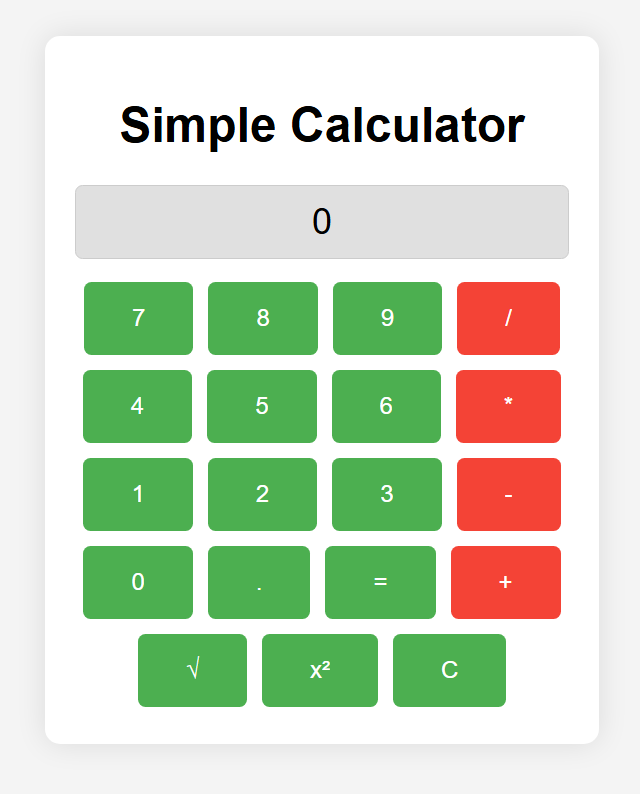

# LLMC

An **LLM-based compiler** to generate and execute code from plain prompts, acting as source code.

---

## Features

- Reads project files with the `*.llmc.json` extension (one per directory).
- Generates an `undo.executor.txt` file for undo operations.
- Allows cleanup operations by renaming `undo.executor.txt` to `cleanup.executor.txt`. LLMC will detect and execute the cleanup commands, then stop.

---

## How to Use

### General Workflow:
1. Place your prompt files (e.g., `*.prompt.txt`) in the project directory.
2. Create a single `*.llmc.json` project file for each directory.
3. Run `llmc` to:
   - Parse prompts.
   - Generate the desired outputs (code, files, scripts, etc.).
   - Execute any `PostBuild` commands defined in the prompt.

### Help Commands:
When executed, `llmc` provides guidance:
```plaintext
* It looks for *.llmc.json as a project file. There should be only one such file in the directory.
* It generates undo.executor.txt for any undo operation.
* Rename the undo file to cleanup.executor.txt - So whenever llmc runs and finds this file, it will execute all undo operations and then stop.
```
---

## Sample Prompt Files

Below are examples of prompt files and their expected behavior.

#### `calculatorpage.prompt.txt`
```plaintext
Prompt:
- IncludeDateTime
- IncludeLs
PostBuild:
- ExecuteCmd(batchCode="index.html")
---
Write a single html file "index.html". It should render some javascript, css, and HTML buttons to build a functional calculator. 
Keep it colorful with good typography and elegant. Support basic operations e.g., +, -, *, /, pow, sqrt. 
Give the instructions to save the file as `index.html`.
```




#### `makegitignoredotnet.prompt.txt`
```plaintext
Prompt:
- IncludeDateTime
- IncludeLs
PostBuild:
---
Write a `.gitignore` file for a C# project. 
The file must also exclude the `bin` and `obj` folders. 
Give instructions to save the file.
```

#### `helloworldpage.prompt.txt`
```plaintext
Prompt:
- IncludeDateTime
- IncludeLs
PostBuild:
- RenameFile(from="goodmorning.html", to="index.html")
- ExecuteCmd(batchCode="index.html")
---
Write an HTML file with a beautiful CSS framework that shows the text "Good morning Prateek" with excellent animations and typography. 
Also, keep it colorful but high contrast and easy on the eyes. After the wishes, include a paragraph with good typography and a motivational poem. 
Avoid using NodeJS. Additionally, include an SVG drawing related to the theme. 
Save the file with the name **goodmorning.html** and don't open it.
```


## Setting Up an LLM Connection

To use LLMC, you'll need to configure an LLM backend. Currently, **Gemini** is supported.

### Steps to Configure Gemini:
1. Obtain an API key from Gemini.
2. Set the API key as an environment variable:
   ```bash
   GEMINI_API_KEY=<your-gemini-api-key>
   ```
3. LLMC will automatically use this key during execution.

---

## Developer Notes

- **Extensibility**: Developers are encouraged to modify the inference code to support additional LLM backends or enhance existing features.
- **Prompt Flexibility**: Customize prompt structures or extend the post-build commands to suit your workflow.

---

## Contributing

We welcome contributions from the community! Follow these steps to contribute:

1. **Fork** the repository on GitHub.
2. Create a new branch for your feature:
   ```bash
   git checkout -b feature/your-feature-name
   ```
3. Implement your changes and commit them:
   ```bash
   git commit -m "Add your-feature-name"
   ```
4. Push your changes to your forked repository:
   ```bash
   git push origin feature/your-feature-name
   ```
5. Open a **Pull Request** and describe your changes in detail.
